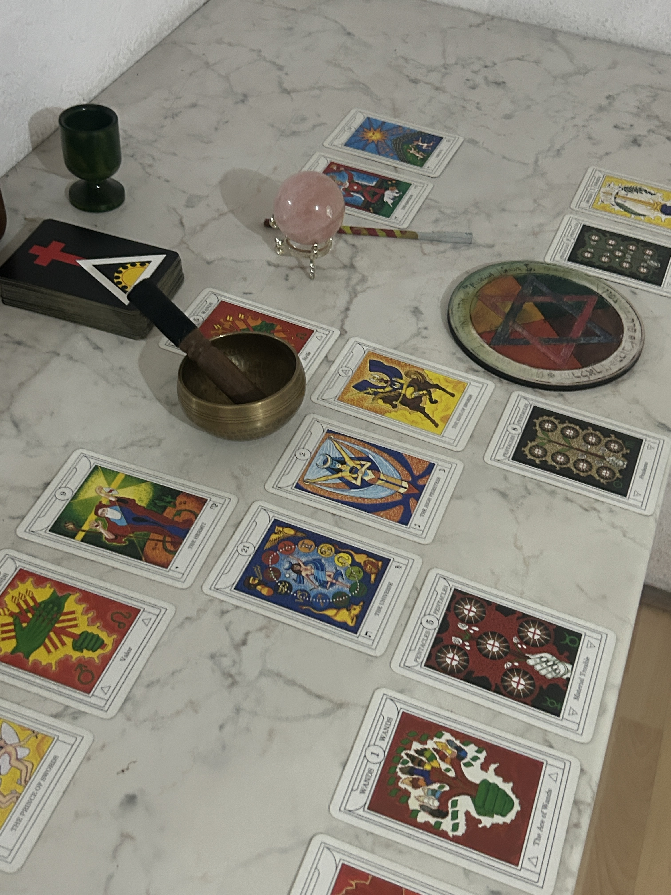

# Cartomantic Practices for Practical Use

**Gaius Jocundus & Thalia Ephemera** — 2026  
Licensed [CC BY 4.0](LICENSE) — free for commercial reuse with attribution.

---

A practitioner's reference for four Western cartomantic systems, arranged in descending order from the cosmological to the circumstantial. Each chapter is a standalone reference; the final chapter addresses the question of which instrument to use and when.

---

## Table of Contents

### [Introduction](epub_intro.md)

---

### Chapter 1: Golden Dawn Magical Tarot (Cicero)

*Preface:* [The Demanding Instrument](epub_preface_gd.md)

**[Golden Dawn Magical Tarot — Full Reference](golden_dawn_magical_tarot.md)**

- [Operating Principles](golden_dawn_magical_tarot.md#operating-principles)
- [The Structural Map](golden_dawn_magical_tarot.md#the-structural-map)
- [The Suits and Their Correspondences](golden_dawn_magical_tarot.md#the-suits-and-their-correspondences)
- [The Qabalistic Framework](golden_dawn_magical_tarot.md#the-qabalistic-framework)
  - The Sephiroth and the Minor Arcana
  - YHVH and the Court Cards
- [The Major Arcana](golden_dawn_magical_tarot.md#the-major-arcana)
- [The Aces](golden_dawn_magical_tarot.md#the-aces)
- [The Court Cards](golden_dawn_magical_tarot.md#the-court-cards)
  - Kings — Yod, Fire of the suit
  - Queens — Heh, Water of the suit
  - Princes — Vau, Air of the suit
  - Princesses — Heh final, Earth of the suit
- [The Minor Arcana: Pip Cards 2–10](golden_dawn_magical_tarot.md#the-minor-arcana-pip-cards-210)
- [Elemental Dignities](golden_dawn_magical_tarot.md#elemental-dignities)
- [Features Specific to the Cicero Deck](golden_dawn_magical_tarot.md#features-specific-to-the-cicero-deck)
- [Suit Harmony and Antagonism](golden_dawn_magical_tarot.md#suit-harmony-and-antagonism)
- [Spreads](golden_dawn_magical_tarot.md#spreads)
- [Notes on Combinations](golden_dawn_magical_tarot.md#notes-on-combinations)
- [On Reversals](golden_dawn_magical_tarot.md#on-reversals)

---

### Chapter 2: The Smith-Waite Tarot

*Preface:* [The Structure Behind the Scene](epub_preface_sw.md)

**[The Smith-Waite Tarot — Full Reference](smith_waite_tarot.md)**

- [Operating Principles](smith_waite_tarot.md#operating-principles)
- [The Structure](smith_waite_tarot.md#the-structure)
- [The Suits and Their Correspondences](smith_waite_tarot.md#the-suits-and-their-correspondences)
- [The Esoteric Framework](smith_waite_tarot.md#the-esoteric-framework)
- [Key Departures from the Golden Dawn Tradition](smith_waite_tarot.md#key-departures-from-the-golden-dawn-tradition)
- [The Major Arcana](smith_waite_tarot.md#the-major-arcana)
- [The Aces](smith_waite_tarot.md#the-aces)
- [The Court Cards](smith_waite_tarot.md#the-court-cards)
- [The Minor Arcana: Pip Cards 2–10](smith_waite_tarot.md#the-minor-arcana-pip-cards-210)
- [On Reversals](smith_waite_tarot.md#on-reversals)
- [Notes on Combinations](smith_waite_tarot.md#notes-on-combinations)

---

### Chapter 3: English Playing Card Cartomancy

*Preface:* [Descending to the Circumstantial](epub_preface_english.md)

**[English Playing Card Cartomancy — Full Reference](english_playing_card_system.md)**

- [Operating Principles](english_playing_card_system.md#operating-principles)
- [The Suits](english_playing_card_system.md#the-suits)
- [Suit Balance](english_playing_card_system.md#suit-balance)
- [Numerological Logic](english_playing_card_system.md#numerological-logic)
- [The Number Cards](english_playing_card_system.md#the-number-cards)
- [The Court Cards](english_playing_card_system.md#the-court-cards)
- [The Joker](english_playing_card_system.md#the-joker)
- [The Ace of Spades](english_playing_card_system.md#the-ace-of-spades)
- [Spreads](english_playing_card_system.md#spreads)
- [Notes on Combinations](english_playing_card_system.md#notes-on-combinations)
- [On Reversals](english_playing_card_system.md#on-reversals)

---

### Chapter 4: The Lenormand Oracle

*Preface:* [From Word to Sentence](epub_preface_lenormand.md)

**[Lenormand Oracle — Full Reference](lenormand_playing_card_oracle.md)**

- [Operating Principles](lenormand_playing_card_oracle.md#operating-principles)
- [The Structure](lenormand_playing_card_oracle.md#the-structure)
- [The Significators](lenormand_playing_card_oracle.md#the-significators)
- [The 36 Cards](lenormand_playing_card_oracle.md#the-36-cards)
- [Reading Method: Combination](lenormand_playing_card_oracle.md#reading-method-combination)
- [The Grand Tableau: Layout](lenormand_playing_card_oracle.md#the-grand-tableau-layout)
- [The Grand Tableau: Spatial Logic](lenormand_playing_card_oracle.md#the-grand-tableau-spatial-logic)
- [The House System](lenormand_playing_card_oracle.md#the-house-system)
- [Notes on Combinations](lenormand_playing_card_oracle.md#notes-on-combinations)
- [On Reversals](lenormand_playing_card_oracle.md#on-reversals)

---

### Chapter 5: The Hermes Playing Card Oracle — Additional Layer

**[Hermes Playing Card Oracle — Full Reference](lenormand_playing_card_oracle.md#the-hermes-playing-card-oracle--additional-layer)**

- [The Hermes Deck: Structure](lenormand_playing_card_oracle.md#the-hermes-deck-structure)
- [The Hermes Significators and the English System](lenormand_playing_card_oracle.md#the-hermes-significators-and-the-english-system)
- [The 16 Expansion Cards](lenormand_playing_card_oracle.md#the-16-expansion-cards)
- [The Clouds Card: Place's Specific Instruction](lenormand_playing_card_oracle.md#the-clouds-card-places-specific-instruction)
- [The 54-Card Grand Tableau](lenormand_playing_card_oracle.md#the-54-card-grand-tableau)
- [Place's Spatial Logic: The Facing-Direction Method](lenormand_playing_card_oracle.md#places-spatial-logic-the-facing-direction-method)

---

### [The Four Instruments in Practice](epub_final.md)

- [The Four Registers](epub_final.md#the-four-registers)
- [The Four Methodologies](epub_final.md#the-four-methodologies)
- [The Question Decides the Instrument](epub_final.md#the-question-decides-the-instrument)
- [Time Across the Four Systems](epub_final.md#time-across-the-four-systems)
- [The Person in the Cards](epub_final.md#the-person-in-the-cards)
- [On Systems Not Covered](epub_final.md#on-systems-not-covered)

---

### Appendix

**[Complete Narrative Text](cartomantic_practices_for_practical_use.md)** — Introduction, all inter-chapter prefaces, and the final chapter in a single continuous document.

---

## License

© 2026 Gaius Jocundus & Thalia Ephemera.  
This work is licensed under [Creative Commons Attribution 4.0 International (CC BY 4.0)](LICENSE).  
You are free to share and adapt this material, including for commercial purposes, provided attribution is given.
