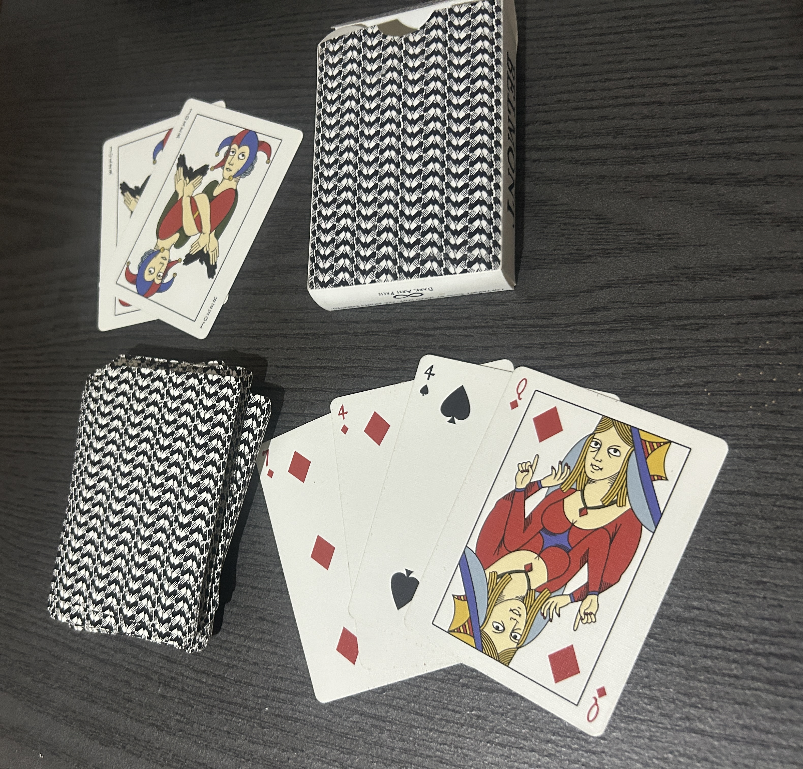

# English Playing Card Cartomancy

## Operating Principles

This system operates at the level of circumstance, relationship, and temporal movement —
the texture of ordinary life. It answers questions about what is actually happening and
to whom.

The Ace is the highest card, not the first. It is the fullest expression of the suit's power,
not its seed.

One Joker is included. See below.

---

## The Suits

**Hearts** — the personal and emotional sphere. Love, friendship, home, family, happiness,
what is held dear. The suit of interior life and intimate relationship. Favorable in almost any
position. When Hearts dominate a reading, the question is essentially about how people feel
and what they want emotionally.

**Diamonds** — the material and communicative sphere. Money, property, practical affairs,
messages, news, correspondence, travel for practical purposes. Also: gifts, offers,
transactions. Diamonds describe the movement of things and information in the world. Neutral
in character — neither fortunate nor unfortunate by nature, they describe material reality as
it stands.

**Clubs** — the sphere of enterprise and effort. Work, ambition, business, social activity,
building, growth through action. Generally favorable — a Clubs-heavy reading indicates
movement, initiative, things being built or accomplished. The suit of what you make happen
through your own effort.

**Spades** — the sphere of challenge and consequence. Conflict, opposition, delay, difficulty,
loss, endings, necessary hard truths. Not simply negative — Spades describe what costs
something, what must be faced, what cannot be avoided. They are the suit of serious things. A
reading without Spades is sometimes a reading that isn't telling the whole truth.

---

## Suit Balance

Before reading individual cards, note the distribution across suits:

- Hearts-heavy: an emotional situation at its core
- Diamonds-heavy: a material or communicative situation
- Clubs-heavy: something being built or worked for
- Spades-heavy: a serious situation with real costs

No Spades in a reading is worth noting — either the situation genuinely has no difficult
dimension, or the querent isn't asking the right question.

---

## Numerological Logic

The numbers carry inherent qualitative character that operates consistently across all four
suits. This is not Kabbalistic numerology — it is not derived from the Sephiroth and should
not be read through that framework. It is experiential and associative, accumulated through
centuries of practical use. The suit tells you the domain; the number tells you what is
happening within that domain.

Understanding the number's character lets you derive meaning intuitively when a specific card
feels uncertain, and helps you read the logic of a sequence when multiple cards of the same
number appear in a spread.

**Ace** — maximum force. The suit's power at fullest expression. Singular, undivided,
definitive. Whatever the suit governs, the Ace says: this matters completely. A peak, not
a beginning — the thing itself, fully present.

**Two** — duality. A meeting, a pairing, a choice between two paths. Two forces in relation.
Can be harmonious partnership or direct opposition depending on suit. The number of encounter
— something is meeting something else.

**Three** — multiplication, social force, a third element entering. Two becomes three: a
relationship gains a third party, a plan gains complication or support, the private becomes
social. The number of groups, of things coming into early form, of initial results appearing.

**Four** — consolidation. What was set in motion has found a stable form. Can be restful or
stagnant depending on suit and context. The number of things that have settled — for better
(a stable foundation) or worse (nothing moving, things stuck).

**Five** — disruption. The stable four has been disturbed. Change is forced, whether welcome
or not. The number of instability, of what breaks open what was settled. In favorable suits
this can be welcome disruption — new people, new energy. In difficult suits it is loss or
conflict.

**Six** — gradual resolution. After the disruption of five, things begin to move toward
balance. Not arrival — that is ten — but the movement toward it. The number of journeys,
reconciliations, slow improvements. Things are not yet resolved but are resolving.

**Seven** — the obstacle, the test, the thing requiring careful handling. The number of what
demands attention and patience. Not catastrophe — that is the Ace of Spades — but the
friction that slows or complicates. Often a warning: something needs addressing before it
worsens.

**Eight** — movement and arrival. Things accelerating, news coming in, people or events
approaching. The number of what is in motion toward the querent or toward resolution. Often
literal travel or communication in this system.

**Nine** — near completion, intensity. The suit character operating at near-maximum force.
Whatever the suit governs is present in full strength — for Hearts, the fullest emotional
state (the wish card); for Spades, the deepest difficulty. The number of things on the edge
of completion or crisis, one step before the end.

**Ten** — completion and outcome. The cycle has run its course. Whatever the suit was moving
toward has arrived. This is the full result — favorable in good suits, final and heavy in
difficult ones. The 10 of Spades is not just difficulty; it is difficulty fully realized and
finished.

**On multiple cards of the same number in a spread:** when two or more cards share a number,
that number's quality is emphatic in the reading. Two fours: deep stagnation or profound
stability. Three sevens: significant obstacles requiring serious attention. Four nines: a
situation at crisis point across multiple domains simultaneously. Read the number's character
first, then the suits for which domains are affected.

---

## The Number Cards

### Aces — the fullest expression of the suit's power

- **Ace of Hearts**: the home, deep love, a central emotional truth
- **Ace of Diamonds**: a significant financial event, an important message or letter
- **Ace of Clubs**: major success, a significant new enterprise
- **Ace of Spades**: the most serious card in the deck. Major challenge, a significant ending,
  the hardest truth in the reading. Not death literally but the kind of ending that changes
  everything.

### Twos — partnership, duality, choice, meeting, agreement

- **2 of Hearts**: mutual affection, a successful partnership in love
- **2 of Diamonds**: a financial partnership or agreement, sometimes a departure
- **2 of Clubs**: opposition or gossip thwarting an enterprise, a difficult partnership in work
- **2 of Spades**: division, separation, a parting of ways — physical or emotional

### Threes — a third party, groups, social situations, initial resolution or complication

- **3 of Hearts**: celebration, good company, a happy gathering, congratulations
- **3 of Diamonds**: legal matters, domestic disputes, sometimes a third party in a financial
  situation
- **3 of Clubs**: a second marriage or romantic complication, social success
- **3 of Spades**: removal, a parting, tears — sorrow with social dimension

### Fours — stability, consolidation, rest; also stagnation

- **4 of Hearts**: a journey, travel for personal reasons, a change in domestic circumstances
- **4 of Diamonds**: inheritance, an unexpected financial change, money from an unexpected source
- **4 of Clubs**: a change of plans, a warning against incaution, instability in enterprise
- **4 of Spades**: illness, convalescence, a period of forced rest or retreat

### Fives — instability, change, disruption of what was established

- **5 of Hearts**: jealousy, uncertainty in love, a fickle heart, indecision
- **5 of Diamonds**: good news regarding money, a prosperous message
- **5 of Clubs**: new friends, new alliances, help arriving from an unexpected quarter
- **5 of Spades**: loss, mourning, grief, something taken away

### Sixes — gradual movement, things stabilizing or resolving slowly

- **6 of Hearts**: unexpected good fortune, a gift from the past, something returning
- **6 of Diamonds**: an early marriage or union, financial matters improving, a reconciliation
- **6 of Clubs**: business success, a commercial journey bearing fruit
- **6 of Spades**: a journey by water, travel, a transition from one state to another — often
  improvement after difficulty

### Sevens — obstacles, tests, things requiring patience or careful action

- **7 of Hearts**: someone unreliable, a promise that may not hold, pleasant but inconstant
- **7 of Diamonds**: a child, a minor argument about money, something small disrupting
  material affairs
- **7 of Clubs**: imprudence, recklessness, prosperity threatened by careless action
- **7 of Spades**: loss through theft, treachery, a warning about trust

### Eights — movement, news arriving, things accelerating or crystallizing

- **8 of Hearts**: a journey for love or pleasure, a visit, travel toward someone
- **8 of Diamonds**: a short journey, a small practical trip, a business errand
- **8 of Clubs**: the approach of a dark-haired person, travel, movement in work matters
- **8 of Spades**: disappointment, sorrow, opposition from someone in authority, plans blocked

### Nines — near completion, strong outcomes, the suit character at near-maximum intensity

- **9 of Hearts**: the wish card. The most fortunate card in the deck. What the querent most
  desires.
- **9 of Diamonds**: a surprise, unexpected news — direction determined by surrounding cards
- **9 of Clubs**: unexpected fortune, a significant achievement, the reward of perseverance
- **9 of Spades**: illness, bad luck, the darkest card after the Ace of Spades. Profound
  difficulty.

### Tens — completion, full outcomes, the end of a cycle

- **10 of Hearts**: good fortune, happiness, the best possible outcome for personal and
  emotional matters
- **10 of Diamonds**: a journey, a change of residence, significant financial change
- **10 of Clubs**: unexpected good fortune through enterprise, a windfall through work
- **10 of Spades**: grief, misfortune, tears. Also: completion of a difficult cycle, the end
  of a hard road.

---

## The Court Cards

Courts represent people in the querent's life, or aspects of the querent, depending on
context. The coloring system is a mnemonic for character type, not literal physical
description — use suit character as the primary identifier.

**Hearts courts** — fair complexion, light hair, light eyes. Affectionate, emotional, artistic.
**Diamonds courts** — fair to medium complexion, light to medium hair. Practical, materialistic, active.
**Clubs courts** — dark complexion, dark hair, dark eyes. Ambitious, energetic, passionate.
**Spades courts** — serious, authoritative, associated with difficult matters and power.

### Kings — mature men, authority figures, men of expertise or power

- **King of Hearts**: a fair, kind, generous man. Affectionate, good-natured. A reliable
  friend or partner.
- **King of Diamonds**: a stubborn, powerful man. Successful in business, not always
  trustworthy. Watch his actions more than his words.
- **King of Clubs**: a dark, generous, faithful man. A good friend, a trustworthy ally in
  enterprise.
- **King of Spades**: a dark, ambitious, dangerous man. Powerful but potentially treacherous.
  A lawyer, a doctor, someone who works with difficult matters.

### Queens — mature women, or the feminine principle in a situation

- **Queen of Hearts**: a fair, loving, gentle woman. Affectionate, imaginative, good counsel.
- **Queen of Diamonds**: a flirtatious, worldly woman. Practical and capable, but
  self-interested.
- **Queen of Clubs**: a dark, confident, attractive woman. Trustworthy, helpful, a strong
  ally.
- **Queen of Spades**: a dark, widowed or separated woman, or a woman who brings difficult
  news. Serious, possibly resentful.

### Jacks — young people, messengers, the approach of news

- **Jack of Hearts**: a fair young person, good-natured but unreliable. Often represents a
  lover or admirer.
- **Jack of Diamonds**: a fair young person with unreliable news or intentions. A
  fair-weather friend.
- **Jack of Clubs**: a reliable, dark young person. A true friend, good news arriving.
- **Jack of Spades**: a dark young person with bad news, or an agent of opposition. A spy or
  an adversary.

### Court Card Adjacency

A court card next to a number card of the same suit: that person acting directly in that
suit's domain. The King of Clubs next to the 9 of Clubs is a powerful man whose effort is
about to pay off.

A court card flanked by Spades: that person is under difficulty or opposition.

---

## The Joker

Represents the querent themselves, or an unexpected wildcard event that overturns the
reading's apparent direction. When it falls, the surrounding cards describe what the querent
is being thrown into rather than what is approaching in an orderly way.

---

## The Ace of Spades

Treat it with respect. It is the most serious card in the system. It does not mean physical
death — it means the death of a situation, a significant ending, a confrontation with hard
truth. Its position in the spread and what surrounds it determines whether this is a necessary
ending or a threatening one.

---

## Spreads

### Single Card
The most direct question. Draw one card to identify the force or condition present. What is
the character of this situation, right now?

### Three Card
Most naturally read as: the force passing — the force present — the force approaching.
Or: what is hidden — what is visible — what is forming.

### Five Card Cross
- Center: the heart of the matter
- Above: the higher-level influence, what is aspired to
- Below: the foundation, what is buried or unacknowledged
- Left: what is moving away, the past
- Right: what is approaching, the direction of movement

### Line of Seven
Lay seven cards in sequence and read as a temporal or causal arc — the story of the situation
from origin to probable resolution.

---

## Notes on Combinations

Certain pairs carry weight beyond individual card meanings and accumulate through use. Note
significant combinations as they emerge in practice. Starting points:

- **9 of Hearts near Ace of Spades**: what you most desire is blocked by the most serious
  obstacle
- **10 of Hearts with 10 of Clubs**: lasting happiness through honest effort
- **Ace of Spades near a court card**: that person is the source or the bearer of the
  difficulty
- **9 of Spades near 9 of Hearts**: the wish and the fear in direct tension

Record combinations that prove live in your own readings and add them here.

---

## On Reversals

Not used in this system. Position and surrounding cards carry the modifying weight.
