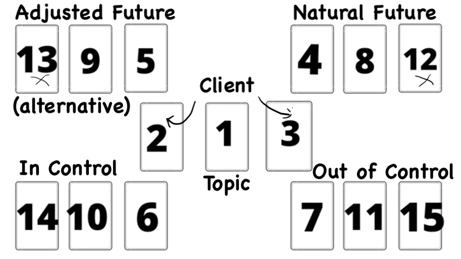

# Golden Dawn Magical Tarot (Cicero)

## Operating Principles

This system operates at the level of archetypal and cosmological forces. Every card is simultaneously a station in the Qabalistic map of reality, an astrological event, a divinatory force, and a meditative object. Reading the deck competently requires holding all layers at once without collapsing them into each other.

The Cicero deck (*The New Golden Dawn Ritual Tarot*, 1991, Llewellyn) was created at the direct request of Israel Regardie, who wanted a deck that fulfilled both divinatory and ritual requirements of the GD system. It is the first deck to systematically employ the Qabalistic Color Scales and flashing colors. Its imagery is drawn from Book T — the original GD document on the Tarot attributed to S.L. MacGregor Mathers, c. 1888.

Every card in the system is simultaneously: a Qabalistic correspondence (Sephirah or Path on the Tree of Life), an astrological correspondence (planet, sign, or element), a divinatory force, and a meditative object. Reading this deck competently requires holding all layers at once without collapsing them into each other.

The deck contains 79 cards: the standard 78, plus a second version of Temperance required by GD ritual practice.

Reversals are not used in this system. Elemental dignities carry the modifying weight — see the Dignities section below.

------------------------------------------------------------------------

## The Structural Map

| Group          | Cards                                   | Qabalistic Assignment                           |
|:---------------|:----------------------------------------|:------------------------------------------------|
| Major Arcana   | 0–XXI                                   | The 22 Paths on the Tree of Life                |
| 4 Aces         | —                                       | Kether of each suit (above the Tree)            |
| 16 Court Cards | King, Queen, Prince, Princess × 4 suits | Letters of YHVH × 4 elements                    |
| 36 Pip Cards   | 2–10 × 4 suits                          | Sephiroth 2–10 × 4 elements; 36 Zodiacal Decans |

The Aces are not on the Tree proper — they are the radical, undifferentiated root force of each element, placed at the North Pole of the universe. The Major Arcana trace the Paths between Sephiroth. The Minor Arcana describe the Sephiroth themselves operating through each elemental world.

------------------------------------------------------------------------

## The Suits and Their Correspondences

**Wands — Fire — Atziluth (the Archetypal World)** The suit of will, ambition, enterprise, spiritual force. Pure creative energy before it has found a form. The Tetragrammaton letter Yod. Sacred to the element of Fire. In Qabalistic cosmology, the highest and most rarefied world — the world of pure divinity. In divination: vitality, initiative, courage, conflict, enterprise. The suit of what is being willed into existence.

**Cups — Water — Briah (the Creative World)** The suit of emotion, imagination, the unconscious, relationship, the fertile receptive force. The Tetragrammaton letter Heh. Sacred to Water. Briah is the world of archangelic intelligence — where divine will becomes creative impulse. In divination: love, feeling, vision, the interior life, things perceived rather than willed.

**Swords — Air — Yetzirah (the Formative World)** The suit of intellect, conflict, analysis, language, and the double-edged nature of thought. The Tetragrammaton letter Vau. Sacred to Air. Yetzirah is the angelic world — the world of formation, where patterns take shape before manifesting. In divination: mind, struggle, communication, truth, and the consequences of thought. The most dangerous suit in the deck — intelligence without wisdom cuts.

**Pentacles — Earth — Assiah (the Material World)** The suit of manifestation, the physical plane, body, money, work, the tangible result of all the higher worlds activity. The Tetragrammaton letter Heh final. Sacred to Earth. Assiah is the material world, the outermost expression of divine force. In divination: matter, health, finance, practical affairs, and the physical body. Pentacles are neither fortunate nor unfortunate by nature — they describe what has actually manifested.

------------------------------------------------------------------------

## The Qabalistic Framework

### The Sephiroth and the Minor Arcana

The numbered pip cards 2–10 correspond to nine of the ten Sephiroth. Kether (1) is the Ace — placed above the sequence as radical root force. The number tells you which Sephirahs quality is active in that elemental world.

| Number | Sephirah  | Character                                                                                       |
|:-------|:----------|:------------------------------------------------------------------------------------------------|
| Ace    | Kether    | Crown; radical, undivided force; the pure essence of the suit                                   |
| 2      | Chokmah   | Wisdom; initiating polarity; the King and Queen just uniting; beginnings                        |
| 3      | Binah     | Understanding; production of the Prince; the first concrete form; realization through restraint |
| 4      | Chesed    | Mercy; production of the Princess; matter fixed and settled; foundations                        |
| 5      | Geburah   | Severity; strife; disturbance of the fixed order; severance                                     |
| 6      | Tiphareth | Beauty; definite accomplishment; the Sun of the system; success and harmony                     |
| 7      | Netzach   | Victory; a force transcending the material plane; result depends on action taken                |
| 8      | Hod       | Splendor; swift directed force; very great executive power; too hasty                           |
| 9      | Yesod     | Foundation; fundamental force; solidity; strength; the approach of completion                   |
| 10     | Malkuth   | Kingdom; fixed, culminated force; the matter thoroughly determined; final result                |

### YHVH and the Court Cards

The four court ranks carry the four letters of the divine name, in order:

| Rank     | Letter        | Element           | Quality                                                                               | Image in Book T                       |
|:---------|:--------------|:------------------|:--------------------------------------------------------------------------------------|:--------------------------------------|
| King     | Yod (י)       | Fire of the suit  | Swift, violent, initiating; effect passes quickly                                     | Armored figure on horseback           |
| Queen    | Heh (ה)       | Water of the suit | Reflective, receptive; both swift and enduring; the throne of the force               | Armored figure on throne              |
| Prince   | Vau (ו)       | Air of the suit   | Son of King and Queen; rapid and enduring; power vain unless set in motion by parents | Armored figure in chariot             |
| Princess | Heh final (ה) | Earth of the suit | Daughter of King and Queen; combines all three; violent and permanent in matter       | Standing figure, Amazon, little armor |

------------------------------------------------------------------------

## The Major Arcana

The 22 Keys are the 22 Paths on the Tree of Life — the channels of force connecting the ten Sephiroth. Each path is the living energy moving between two specific spheres. Every Path has a Hebrew letter, an astrological attribution, and a specific divinatory meaning derived from the interaction of the two Sephiroth it bridges.

The Golden Dawn titles are the names Mathers assigned in the initiation grades. Memorizing them is not required but provides a second reading angle: they describe the archetypal function rather than the cards surface imagery.

| Key   | Name               | Hebrew Letter | Meaning of Letter | Attribution | Path                   | GD Title                                                        |
|:------|:-------------------|:--------------|:------------------|:------------|:-----------------------|:----------------------------------------------------------------|
|       | The Fool           | Aleph         | Ox                | Air         | 11 (Kether–Chokmah)    | Spirit of the Ether                                             |
| I     | The Magician       | Beth          | House             | Mercury     | 12 (Kether–Binah)      | Magus of Power                                                  |
| II    | The High Priestess | Gimel         | Camel             | Moon        | 13 (Kether–Tiphareth)  | Priestess of the Silver Star                                    |
| III   | The Empress        | Daleth        | Door              | Venus       | 14 (Chokmah–Binah)     | Daughter of the Mighty Ones                                     |
| IV    | The Emperor        | Heh           | Window            | Aries       | 15 (Chokmah–Tiphareth) | Son of the Morning, Chief Among the Mighty                      |
| V     | The Hierophant     | Vau           | Nail              | Taurus      | 16 (Chokmah–Chesed)    | Magus of the Eternal                                            |
| VI    | The Lovers         | Zayin         | Sword             | Gemini      | 17 (Binah–Tiphareth)   | Children of the Voice: Oracle of the Mighty Gods                |
| VII   | The Chariot        | Cheth         | Fence             | Cancer      | 18 (Binah–Geburah)     | Child of the Powers of the Waters: Lord of the Triumph of Light |
| VIII  | Strength           | Teth          | Serpent           | Leo         | 19 (Chesed–Geburah)    | Daughter of the Flaming Sword                                   |
| IX    | The Hermit         | Yod           | Hand              | Virgo       | 20 (Chesed–Tiphareth)  | Prophet of the Eternal: Magus of the Voice of Power             |
| X     | Wheel of Fortune   | Kaph          | Closed Hand       | Jupiter     | 21 (Chesed–Netzach)    | Lord of the Forces of Life                                      |
| XI    | Justice            | Lamed         | Ox Goad           | Libra       | 22 (Geburah–Tiphareth) | Daughter of the Lords of Truth: Ruler of the Balance            |
| XII   | The Hanged Man     | Mem           | Water             | Water       | 23 (Geburah–Hod)       | Spirit of the Mighty Waters                                     |
| XIII  | Death              | Nun           | Fish              | Scorpio     | 24 (Tiphareth–Netzach) | Child of the Great Transformers: Lord of the Gate of Death      |
| XIV   | Temperance         | Samekh        | Prop              | Sagittarius | 25 (Tiphareth–Yesod)   | Daughter of the Reconcilers: Bringer Forth of Life              |
| XV    | The Devil          | Ayin          | Eye               | Capricorn   | 26 (Tiphareth–Hod)     | Lord of the Gates of Matter: Child of the Forces of Time        |
| XVI   | The Tower          | Peh           | Mouth             | Mars        | 27 (Netzach–Hod)       | Lord of the Hosts of the Mighty                                 |
| XVII  | The Star           | Tzaddi        | Fish Hook         | Aquarius    | 28 (Netzach–Yesod)     | Daughter of the Firmament: Dweller between the Waters           |
| XVIII | The Moon           | Qoph          | Back of Head      | Pisces      | 29 (Netzach–Malkuth)   | Ruler of Flux and Reflux: Child of the Sons of the Mighty       |
| XIX   | The Sun            | Resh          | Head              | Sol         | 30 (Hod–Yesod)         | Lord of the Fire of the World                                   |
| XX    | Judgement          | Shin          | Tooth             | Fire        | 31 (Hod–Malkuth)       | Spirit of the Primal Fire                                       |
| XXI   | The Universe       | Tau           | Cross             | Saturn      | 32 (Yesod–Malkuth)     | Great One of the Night of Time                                  |

### Major Arcana Divinatory Meanings

Brief divinatory forces, based on Book T. In the GD system, the question is always one of dignity — a card surrounded by harmonious cards expresses its positive force; in adverse company it expresses its negative force. Both poles are given.

**0 — The Fool** Leap into the unknown, pure potentiality, spiritual vision detached from material consequence. The energy of Air at its most ungrounded — either transcendence or folly, depending entirely on what surrounds it. The only card in the deck without a Sephirothic anchor. Unconditioned spirit. *Ill-dignified:* Foolishness, mania, recklessness, impractical spirituality.

**I — The Magician** Skill, adaptability, will applied with precision. The directed power of Mercury — the link between above and below, the mind that can work in any medium. Craft, intelligence in service of purpose. *Ill-dignified:* Cunning, deception, will directed to manipulation.

**II — The High Priestess** Change, fluctuation, the rhythmic principle. The deep inner knowing that precedes speech. Initiation, occult wisdom, things not yet revealed. The lunar mind. *Ill-dignified:* Vacillation, unreliability, change without direction.

**III — The Empress** Fertility, abundance, beauty, pleasure, the creative principle in full expression. Nature doing what nature does. Growth, sensory life, productive activity. *Ill-dignified:* Luxury becoming dissipation, sensuality without discrimination.

**IV — The Emperor** Conquest, governance, the establishment of order through will and force. The solar fire of Aries — initiating, dominating, structuring. Authority and the capacity to build systems. *Ill-dignified:* Domination, rigidity, conquest without wisdom.

**V — The Hierophant** Teaching, initiation, the transmission of sacred knowledge. Wisdom made available to others. The fixed earthly wisdom that opens doors. Institutions at their best. *Ill-dignified:* Dogma, ceremony without substance, authority that prevents rather than initiates.

**VI — The Lovers** Intuition, second sight, the right choice made through inspiration rather than calculation. Union, partnership, the synthesis of opposites into something new. *Ill-dignified:* Unstable decision, temptation, choice made for wrong reasons.

**VII — The Chariot** Triumph through controlled force. Victory achieved, but only if the querent actively strives. The will directing opposing forces (the two sphinxes) toward a single end. Self- mastery as the vehicle of power. *Ill-dignified:* Ruthlessness, victory through domination rather than mastery.

**VIII — Strength** Courage, endurance, the power to face and tame what is fierce. Controlled force that is patient and compassionate rather than merely aggressive. Magnanimity. *Ill-dignified:* Abuse of power, strength used to crush rather than transform.

**IX — The Hermit** Wisdom sought, found, and carried with discretion. Illumination from above. Withdrawal for the purpose of attainment. The inner teacher. The guide. *Ill-dignified:* Excessive withdrawal, isolation for its own sake, self-important secrecy.

**X — Wheel of Fortune** The turning of cycles, fortune moving, change arriving. Jupiters good fortune — but fortune is not in the querents hands. Whatever is turning will turn. *Ill-dignified:* Change for the worse, cycles grinding down rather than lifting.

**XI — Justice** Eternal equilibrium. The truth of the situation as it actually stands, stripped of wishful thinking. What is balanced is balanced; what is out of balance will be corrected. The sword of discrimination. *Ill-dignified:* Imbalance, unfairness, judgment withheld.

**XII — The Hanged Man** Necessary suspension, enforced sacrifice. The work that cannot be hurried. Surrender to a process that cannot be controlled. Sometimes: initiation requiring the sacrifice of a former identity. *Ill-dignified:* Pointless martyrdom, self-punishment, sacrifice for nothing.

**XIII — Death** Transformation, the end of one cycle as the condition for another. Time, change, the great leveler. Not physical death as the primary meaning — the death of circumstances, identities, situations. *Ill-dignified:* Inertia, refusal to transform, stagnation.

**XIV — Temperance** The combination of forces into a working synthesis. Alchemy — the interaction of opposing elements produces something neither contained alone. Moderation as an active art, not a passive restraint. The card of process and testing. *Ill-dignified:* Discord in the combination, unfortunate mixing.

**XV — The Devil** Materiality fully realized. The binding force of the physical plane. Temptation, obsession, the power of compulsion. When well-dignified: intense material force put to work. The Devil is not evil — he is the Lord of Matter. *Ill-dignified:* Enslavement, addiction, the forces of matter actively destructive.

**XVI — The Tower** Sudden catastrophic change. The structure that was built on false foundations is struck down. Cannot be prevented once in motion. Sometimes: liberation through destruction. *Ill-dignified:* Ruin, violence, irrecoverable loss.

**XVII — The Star** Hope, unexpected help, the grace that arrives when it is needed. The clear cosmic perspective restored after the darkness of The Moon. Faith with a basis in reality. *Ill-dignified:* Hopes that will not be fulfilled. Wishful thinking mistaken for vision.

**XVIII — The Moon** Illusion, terror, bewilderment, the forces of the subconscious exerting dangerous pressure. Things are not as they appear. Dreams with teeth. The liminal state between worlds. *Ill-dignified:* Petty errors, self-deception, minor confusion rather than serious danger.

**XIX — The Sun** Joy, contentment, great fortune, clarity, the pleasure of being fully present in a good world. The most unambiguously fortunate of the Major Arcana. *Ill-dignified:* As above but reduced — success less total, happiness less complete.

**XX — Judgement** Final decision, the settling of a matter that has long been pending. The point of no return passed. Culmination, reckoning, the outcome that can now be named. *Ill-dignified:* Delay in judgment, consequences postponed.

**XXI — The Universe** The subject of the question itself — the world as it actually stands. The great synthesis. This card generally describes the situation the querent is actually in rather than adding a force to it. Its meaning is determined almost entirely by what surrounds it.

------------------------------------------------------------------------

## The Aces

The four Aces are not placed on the Tree of Life. They stand above it, at the pole of their element — the undivided, root power before it differentiates into the ten Sephiroth. Treat them as absolute beginnings: not gentle initiations but the first strike of force, before that force has found its form.

**Ace of Wands** — Root of the Powers of Fire Pure will. Raw creative energy, undirected, not yet shaped by any target or consequence. In divination: the force of a new beginning carrying tremendous heat and potential. Everything depends on what the surrounding cards do with it.

**Ace of Cups** — Root of the Powers of Water Pure feeling. The overflowing source — the fountain of clear water that gives life to all the Cup cards below it. Love as a cosmic principle rather than a personal emotion. The deep unconscious becoming available.

**Ace of Swords** — Root of the Powers of Air The invoked blade. Pure intellect as a double-edged force: raised upward, it calls down divine clarity; reversed, it calls down chaos. The Ace of Swords contains both the power of liberation and the power of affliction in equal measure. The most volatile Ace.

**Ace of Pentacles** — Root of the Powers of Earth Materiality in all its forms, good and evil. The seed of everything material: wealth, health, the physical body, the land itself. Neither fortunate nor unfortunate on its own — it shows what has been made possible in matter.

------------------------------------------------------------------------

## The Court Cards

Court cards represent people connected with the matter, or the querent themselves, or dominant forces shaping the situation. Book T specifies: *Princes and Queens show almost always actual men and women. The Kings indicate sudden arrivals and departures. The Princesses show opinions, thoughts, ideas, either in harmony with or opposed to the subject.*

### Kings — Yod, Fire of the suit; swift, initiating

**King of Wands** — Lord of the Flame and Lightning: King of the Spirits of Fire Fire of Fire. The most purely fiery person in the deck — swift, generous, intense, noble, and impetuous. Quick to act, quick to forget. A natural leader whose power is genuine but whose effect rarely endures beyond the moment of his engagement. When this person commits fully, it is extraordinary. He rarely commits fully. *Zodiacal region: 21° Scorpio to 20° Sagittarius.*

**King of Cups** — Lord of the Waves and the Waters: King of the Hosts of the Sea Fire of Water. The person who brings intense emotional force — grace, subtlety, deep feeling, but sometimes violence when pushed. A master of the interior life who can also act decisively. Can be secretive and indirect; often artistic. The fire within the water creates both beauty and occasional explosiveness. *Zodiacal region: 21° Aquarius to 20° Pisces.*

**King of Swords** — Lord of the Wind and the Breezes: King of the Spirits of Air Fire of Air. The person who initiates intellectual force — commanding, brilliant, active in mental pursuits, decisive in judgment. Capable of great authority and great cruelty in equal proportion. The sharpest mind in the room, and the quickest to use it as a weapon. *Zodiacal region: 21° Taurus to 20° Gemini.*

**King of Pentacles** — Lord of the Wide and Fertile Land: King of the Spirits of Earth Fire of Earth. The person who initiates material force — industrious, competent, reliable, potentially slow to change. The energy of someone who builds things and keeps them built. Not exciting. Exactly what is needed when foundations are at stake. *Zodiacal region: 21° Leo to 20° Virgo.*

### Queens — Heh, Water of the suit; enthroned, receiving

**Queen of Wands** — Queen of the Thrones of Flame Water of Fire. The throne upon which fiery force rests and becomes usable — adaptable, persevering, quietly powerful. A person of sustained intensity, less explosive than the King, far more enduring. Self-contained power. May be obstinate; definitely capable. *Zodiacal region: 21° Pisces to 20° Aries.*

**Queen of Cups** — Queen of the Thrones of the Waters Water of Water. The deepest emotional intelligence in the deck — imaginative, visionary, psychically sensitive, the person who knows what others are feeling before they say it. Can be mediumistic, dreamy, or lost in the depths. The mirror surface that shows truth but can also distort. *Zodiacal region: 21° Gemini to 20° Cancer.*

**Queen of Swords** — Queen of the Thrones of Air Water of Air. Perception made sharp and impartial. A person who has suffered and learned to see clearly as a result. The widow, the woman alone, the mind that has lost illusions and is the better for it. Keen intelligence, quiet authority, possible severity. Truth without mercy. *Zodiacal region: 21° Virgo to 20° Libra.*

**Queen of Pentacles** — Queen of the Thrones of Earth Water of Earth. Material intelligence — resourceful, generous, creative in practical domains, the person who makes things beautiful and functional simultaneously. Generous, sometimes to excess. The capacity to make any environment fertile. *Zodiacal region: 21° Sagittarius to 20° Capricorn.*

### Princes — Vau, Air of the suit; in chariot, in motion

**Prince of Wands** — Prince of the Chariot of Fire Air of Fire. Ideas about will — the intellectual dimension of the fiery force. Energetic, hasty, strong, sometimes violent, often wasteful. A person full of initiative and short on follow-through. Brilliant at beginnings. Not to be relied upon for completion.

**Prince of Cups** — Prince of the Chariot of the Waters Air of Water. The person who thinks about feeling — subtle, artistic, reflective, capable of great depth, but sometimes cold or detached behind the emotional sensitivity. A creative force that needs external motivation to manifest its gifts.

**Prince of Swords** — Prince of the Chariot of the Winds Air of Air. The most purely intellectual person in the deck. Clever, penetrating, prone to conflict, excellent at seeing problems and creating new ones. Skill without direction — capable of great things when genuinely committed, destructive when turned on the people around him.

**Prince of Pentacles** — Prince of the Chariot of Earth Air of Earth. Methodical, patient, enduring, hardworking. The person who will actually finish the project and do it correctly. May be overly cautious or inflexible. Utterly reliable in material domains; sometimes limited in vision.

### Princesses — Heh final, Earth of the suit; standing, Amazon

**Princess of Wands** — Princess of the Shining Flame: Rose of the Palace of Fire Earth of Fire — the throne of the Ace of Wands. An idea or spirit that is blazing but not yet in motion. Great enthusiasm that has not yet found its direction. Generosity, courage, beauty, sudden anger. The force before it mounts the horse.

**Princess of Cups** — Princess of the Waters: Lotus of the Palace of the Floods Earth of Water — the throne of the Ace of Cups. Tender, imaginative, kind, the loving impulse not yet disciplined by experience. Artistic gifts in early form. Can be impressionable, inconstant, excessively dreamy.

**Princess of Swords** — Princess of the Rushing Winds: Lotus of the Palace of Air Earth of Air — the throne of the Ace of Swords. Keen, observant, critical, the young mind that wants to cut through everything. Agile intellectually but not always wise about when to use the blade. Can be disputatious for its own sake.

**Princess of Pentacles** — Princess of the Echoing Hills: Rose of the Palace of Earth Earth of Earth — the throne of the Ace of Pentacles. The most material entity in the deck. Thoughtful, quiet, deliberate, generous in practical ways. Strong application once she commits. Prone to obstinacy; not easily moved.

------------------------------------------------------------------------

## The Minor Arcana: Pip Cards 2–10

Each pip card carries three simultaneous attributions:

1.  **Sephirah** (from the number — see Framework above)

2.  **Suit element** (from the suit)

3.  **Zodiacal Decan** (planet in sign — the specific energy operative within that Sephirah)

The Book T title is the precise name of the force — memorize these. They are more useful in practice than any elaborate description.

### Wands (Fire) — suits the three Fire signs: Aries, Leo, Sagittarius

| Card        | Book T Title                 | Decan                  | Divinatory Force                                                                                             |
|:------------|:-----------------------------|:-----------------------|:-------------------------------------------------------------------------------------------------------------|
| of Wands    | Lord of Dominion             | Mars in Aries          | Will fully actualized; influence over others; a power just established. Pride in authority.                  |
| 3 of Wands  | Lord of Established Strength | Sun in Aries           | The first result of will — things built and holding. Enterprise confirmed.                                   |
| 4 of Wands  | Lord of Perfected Work       | Venus in Aries         | Completion; a task done well; the rest that follows genuine effort. Settlement.                              |
| 5 of Wands  | Lord of Strife               | Saturn in Leo          | Conflict, competition, struggle for dominance. Not catastrophe — the friction of opposed wills.              |
| 6 of Wands  | Lord of Victory              | Jupiter in Leo         | Success earned through conflict. The fire has prevailed. Recognition.                                        |
| 7 of Wands  | Lord of Valour               | Mars in Leo            | A position held against opposition. Courage required; the outcome uncertain but the courage is there.        |
| 8 of Wands  | Lord of Swiftness            | Mercury in Sagittarius | Rapid movement, things in flight toward their target. Speed, communication, things arriving.                 |
| 9 of Wands  | Lord of Great Strength       | Moon in Sagittarius    | Enormous reserves of force; tenacity; the capacity to endure. Preparedness.                                  |
| 10 of Wands | Lord of Oppression           | Saturn in Sagittarius  | Overburdening, force turned against itself, the fire become excess weight. Energy spent on the wrong target. |

### Cups (Water) — suits the three Water signs: Cancer, Scorpio, Pisces

| Card       | Book T Title                | Decan             | Divinatory Force                                                                                          |
|:-----------|:----------------------------|:------------------|:----------------------------------------------------------------------------------------------------------|
| of Cups    | Lord of Love                | Venus in Cancer   | The beginning of love; two emotional natures meeting and recognizing each other. Attraction, affinity.    |
| 3 of Cups  | Lord of Abundance           | Mercury in Cancer | Emotional fruition; the abundance that comes from loving connection; celebration, friendship, joy.        |
| 4 of Cups  | Lord of Blended Pleasure    | Moon in Cancer    | Pleasure mixed with something else — satiety, or reflection, or a slight discontent within comfort.       |
| 5 of Cups  | Lord of Loss in Pleasure    | Mars in Scorpio   | Something loved is gone or spoiled. Not catastrophe — loss within an emotional domain that was once rich. |
| 6 of Cups  | Lord of Pleasure            | Sun in Scorpio    | Pleasure recovered; the past offering its gifts; generosity, memory, the sweetness of what was.           |
| 7 of Cups  | Lord of Illusionary Success | Venus in Scorpio  | Attractive visions with no substance behind them; fantasy, wishful thinking, beautiful confusion.         |
| 8 of Cups  | Lord of Abandoned Success   | Saturn in Pisces  | Withdrawal from what was working; the deliberate turning away from a path that no longer satisfies.       |
| 9 of Cups  | Lord of Material Happiness  | Jupiter in Pisces | Satisfaction of desires; the wish realized; contentment. The most fortunate Cup.                          |
| 10 of Cups | Lord of Perfected Success   | Mars in Pisces    | Emotional completion; lasting happiness; the cycle of feeling brought to full fruition.                   |

### Swords (Air) — suits the three Air signs: Libra, Aquarius, Gemini

| Card         | Book T Title                | Decan               | Divinatory Force                                                                                                                        |
|:-------------|:----------------------------|:--------------------|:----------------------------------------------------------------------------------------------------------------------------------------|
| of Swords    | Lord of Peace Restored      | Moon in Libra       | Tension held in balance; the peace achieved by discipline rather than resolution. A truce, not a reconciliation.                        |
| 3 of Swords  | Lord of Sorrow              | Saturn in Libra     | Grief, pain, sorrow. The mind registering a real loss. Cannot be argued away.                                                           |
| 4 of Swords  | Lord of Rest from Strife    | Jupiter in Libra    | Recuperation; truce after battle; the mind resting after conflict. Necessary withdrawal.                                                |
| 5 of Swords  | Lord of Defeat              | Venus in Aquarius   | Loss, conquest by another, failure of a plan. The intelligence used against itself.                                                     |
| 6 of Swords  | Lord of Earned Success      | Mercury in Aquarius | Movement toward calmer waters; earned passage through difficulty; gradual, deliberate improvement.                                      |
| 7 of Swords  | Lord of Unstable Effort     | Moon in Aquarius    | Plans half-made; effort that lacks foundation; the mind undercutting itself. Cunning or evasion.                                        |
| 8 of Swords  | Lord of Shortened Force     | Jupiter in Gemini   | Interference; restriction; a force that cannot reach its target. Bondage, not from outside, but from the mind itself.                   |
| 9 of Swords  | Lord of Despair and Cruelty | Mars in Gemini      | The darkest point of the minds experience. Despair, cruelty — either suffered or wielded. The nightmare.                                |
| 10 of Swords | Lord of Ruin                | Sun in Gemini       | The total collapse of a mental or material structure. Absolute ending, the worst of it over. What follows must be rebuilt from nothing. |

### Pentacles (Earth) — suits the three Earth signs: Capricorn, Taurus, Virgo

| Card            | Book T Title                | Decan                | Divinatory Force                                                                                            |
|:----------------|:----------------------------|:---------------------|:------------------------------------------------------------------------------------------------------------|
| of Pentacles    | Lord of Harmonious Change   | Jupiter in Capricorn | Fluctuation in material circumstances; the ability to balance multiple pressures without being overwhelmed. |
| 3 of Pentacles  | Lord of Material Works      | Mars in Capricorn    | Work begun and progressing; practical skill applied; things being built. The craftsperson at the work.      |
| 4 of Pentacles  | Lord of Earthly Power       | Sun in Capricorn     | Material power consolidated; control over resources; the tendency to hold what is held too tightly.         |
| 5 of Pentacles  | Lord of Material Trouble    | Mercury in Taurus    | Poverty, worry, material difficulty. Things not working in the physical domain. Loss of what sustains.      |
| 6 of Pentacles  | Lord of Material Success    | Moon in Taurus       | Material success; generosity; the right flow of resources between those who have and those who need.        |
| 7 of Pentacles  | Lord of Success Unfulfilled | Saturn in Taurus     | Work done but reward withheld or uncertain; effort without clear outcome; waiting for the harvest.          |
| 8 of Pentacles  | Lord of Prudence            | Sun in Virgo         | Skilled work; mastery of craft; the careful application of intelligence to material tasks.                  |
| 9 of Pentacles  | Lord of Material Gain       | Venus in Virgo       | Abundance through ones own work; material satisfaction; the comfortable life earned.                        |
| 10 of Pentacles | Lord of Wealth              | Mercury in Virgo     | Wealth complete; the culmination of material effort across generations; established prosperity.             |

------------------------------------------------------------------------

## Elemental Dignities

In the GD system, reversals are replaced by dignities. Surrounding cards either strengthen or weaken the card in question, based on elemental harmony and antagonism.

**Elemental relationships:**

|           | Fire              | Water             | Air               | Earth             |
|:----------|:------------------|:------------------|:------------------|:------------------|
| **Fire**  | Strongly friendly | Hostile           | Friendly          | Hostile           |
| **Water** | Hostile           | Strongly friendly | Hostile           | Friendly          |
| **Air**   | Friendly          | Hostile           | Strongly friendly | Hostile           |
| **Earth** | Hostile           | Friendly          | Hostile           | Strongly friendly |

**Rules:**

- Fire and Air are mutually friendly (both active)

- Water and Earth are mutually friendly (both passive)

- Fire and Water are hostile to each other

- Air and Earth are hostile to each other

- A card flanked by two cards of a friendly element is strengthened to full force

- A card flanked by two hostile cards is weakened or reversed in effect

- A card flanked by one friendly and one hostile is neutral; read the cards plain meaning

The Major Arcana carry elemental attributions (Fool = Air, Hanged Man = Water, Judgement = Fire, Universe = Earth, and the rest carry their astrological element). Apply the same dignity logic.

------------------------------------------------------------------------

## Features Specific to the Cicero Deck

**Flashing Colors.** Each card is painted in complementary (opposing on the color wheel) color pairs. Steady gaze produces a visual shimmer or alternation between the two colors. This is an intentional autohypnotic technique: the flash destabilizes ordinary visual processing and opens the meditative state. The Ciceros describe this as part of the cards magical function, not merely its aesthetic.

**The Color Scales.** The deck applies all four Qabalistic Color Scales corresponding to the four Worlds: King Scale (Atziluth/Wands), Queen Scale (Briah/Cups), Prince Scale (Yetzirah/Swords), Princess Scale (Assiah/Pentacles). The pip card backgrounds use the zodiacal color appropriate to the suits world-scale. This is visible on close inspection and changes the meditative quality of each card significantly.

**Two Temperance Cards.** The GD Neophyte initiation ritual requires one orientation of the Temperance figure; the Adeptus Minor ritual requires another. Both are included in the 79-card deck. For divination, use either — they carry the same divinatory force.

**Astrological and Decan Symbols on the Pips.** Each pip card 2–10 displays its astrological sign and planetary ruler as visual symbols, positioned at the top of the card. The Cicero deck makes these attributions readable without consulting external references — the system is literally written on the cards.

------------------------------------------------------------------------

## Suit Harmony and Antagonism

A practical summary for spread reading:

**Wands and Cups together:** Tension, conflict, the fire and water pulling in opposite directions. May still produce a result, but at cost.

**Wands and Swords together:** Mutual reinforcement — both active elements. Swift action, intellectual aggression, decisive movement. Can be reckless.

**Wands and Pentacles together:** Tension — the fiery creative will meeting material resistance. May frustrate or ground depending on which dominates.

**Cups and Pentacles together:** Mutual support — both passive, receptive. Emotional and material wellbeing aligning. Generally favorable.

**Cups and Swords together:** Deep tension — the feeling world and the thinking world at odds. Inner conflict, the head and heart in opposition.

**Swords and Pentacles together:** Tension — the intellectual and material planes resistant to each other. Practicality frustrated by overthinking, or ideas that cant find a material base.

When a spread is dominated by a single suit, read the domain of that suit as the central operating field of the question — even if the question is nominally about something else. The cards often know what the question actually is better than the querent does.

------------------------------------------------------------------------

## Spreads

### Single Card

What is the force operative in this situation? Draw one card for the essential character of the present moment.

### Three Card

**Past — Present — Future** (temporal arc) or: **Above — Below — Between** (what aspires / what grounds / what operates at the crossing point) or: **Thesis — Antithesis — Synthesis** (for questions about opposing forces)

### The Celtic Cross (Ten Cards)

The GD method of preference for complex questions:

1.  The matter itself (center)

2.  What crosses it (the obstacle or second force)

3.  The ideal or aspiration above

4.  The foundation, the buried fact

5.  What is passing away

6.  What is approaching

7.  The querents current position

8.  The environment and external influences

9.  The hopes and fears

10. The outcome

### The Opening of the Key (Five Operations)

The full GD divinatory method from Book T, used for serious inquiry. Requires a full reading session. Involves five successive operations, each using all 78 cards, progressively narrowing the question from the cosmos down to the specific. This method is described in full in the Ciceros companion book *The New Golden Dawn Ritual Tarot*.

### The Fifteen Card Spread (Cicero)

A spread for complex questions that presents two possible paths forward. Documented in the Cicero decks companion material. Fifteen cards are laid out in five rows of three, numbered in a spiral from the centre outward anti-clockwise:

<figure>

<figcaption>Image: <a href="https://seaqueen.wordpress.com/2023/07/18/15-card-english-golden-dawn-spread-featuring-ciro-marchettis-gilded-tarot-royale-deck-commenters-request-part-2-2-clarification-card-barbara-moores-classic-tarot-king-of-wands/" class="uri">https://seaqueen.wordpress.com/2023/07/18/15-card-english-golden-dawn-spread-featuring-ciro-marchettis-gilded-tarot-royale-deck-commenters-request-part-2-2-clarification-card-barbara-moores-classic-tarot-king-of-wands/</a></figcaption>
</figure>

Cards are read in five trinities. The central card of each trinity is the principal; the flanking cards are its modifiers, weighted by elemental dignity. No reversals are used throughout.

- **Cards 1, 2, 3 — The Querent:** Card 1 is the core of the spread: the querent, the nature of the question, and the main operative influences. Cards 2 and 3 extend the reading of card 1, describing the surrounding circumstances and the querents own nature in relation to the matter.

- **Cards 4, 8, 12 — Current Path:** The natural course of events as they would unfold without intervention. Read chronologically left to right.

- **Cards 13, 9, 5 — Alternate Path:** An alternative course of action available to the querent. Read left to right (13 → 9 → 5). If these cards read as continuous with rather than divergent from the current path, treat them as its extension: 4–8–12–13–9–5 in sequence.

- **Cards 6, 10, 14 — Psychological Basis:** The psychological ground and implications of the situation; the interior dimension of the question.

- **Cards 7, 11, 15 — Karma:** Forces operating beyond the querents control. These are not to be resisted but understood and adapted to.

------------------------------------------------------------------------

## Notes on Combinations

Certain pairs carry meaning that exceeds the sum of their individual cards. These accumulate through use. Starting points:

- **Tower near Wheel of Fortune**: sudden reversal of existing fortunes, change neither sought nor chosen

- **High Priestess near any Court Card**: the person is not showing their full nature; there is a hidden dimension

- **Death near Ten of Pentacles**: the transformation of material circumstances at the most fundamental level — inheritance, loss of estate, the passing of an era

- **9 of Cups near The Sun**: the wish granted in full; one of the most fortunate combinations in the deck

- **9 of Swords near The Moon**: the nightmare that is also a real warning, not merely fear; something that must be faced rather than interpreted away

- **3 Swords cards in a single reading**: the domain of intellectual conflict and pain is dominant — do not ignore this, regardless of what other suits appear

- **Multiple court cards from different suits**: multiple people are significantly involved and their elemental natures will either harmonize or conflict

Record combinations that prove live in your own readings and add them here.

------------------------------------------------------------------------

## On Reversals

Not used in this system. Elemental dignities carry the modifying weight. A card surrounded by hostile elements expresses its most difficult face; surrounded by harmonious elements, its most favorable. A lone Sword card in a reading full of Cups reads differently than the same Sword card surrounded by other Swords. Let the relationships between cards do the interpretive work that reversals attempt to do through position.
